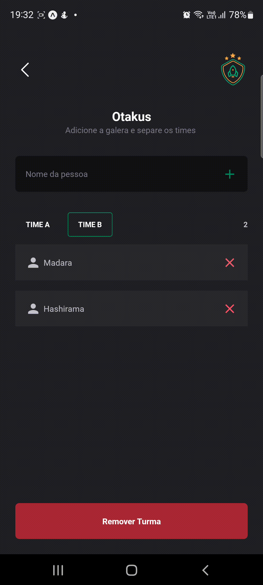

# Teams




## :page_with_curl: About/Sobre

<details>
  <summary markdown="span"><strong>:us: English</strong></summary><br />

Teams is a mobile app that allows the creation of classes for the administration of competitions and games. This is a project developed with the intention of improving my knowledge in React Native and Typescript.
<br />

</details>
<details>
  <summary markdown="span"><strong>:brazil: Português</strong></summary><br />

Teams é um app mobile que permite a criação de turmas para administração de competições e jogos. Esse é um projeto desenvolvido com o intuito de aprimorar meus conhecimentos em React Native e Typescript.
<br />

</details>

## :man_technologist: Developed Skills/Habilidades Desenvolvidas

<details>
  <summary markdown="span"><strong>:us: English</strong></summary><br />

- Mobile App Creation
- State Management
<br />
</details>

<details>
  <summary markdown="span"><strong>:brazil: Português</strong></summary><br />

- Criação de Apps Mobile
- Gerenciamento de Estado
<br />
</details>

## :hammer_and_wrench: Tools/Ferramentas

- React Native
- Async Storage
- Typescript
- Expo
- Styled Components

## :rocket: How to run/Como rodar

<details>
  <summary markdown="span"><strong>:us: English</strong></summary><br />
    
<details open>
<summary markdown="span"><strong>:computer: Local</strong></summary><br />

Before installing make sure you have all the tools necessary to run the project.

### Necessary Tools

- CURL
- Node.js (LTS);
- npm (already installed with Node);
- expo-cli
- Expo GO (Android and/or iOS)

### Installation

To install cURL, if it is not already installed on your machine, use the command:

```bash
    sudo apt-get install curl
```

To check the installation of cURL, run the command:

```bash
    curl --version
```

To install Node and NPM, which comes with the installation of Node, I recommend using NVM, to install NVM, access the Official Repository of NVM;

After installing NVM and a Node version (I recommend version 16), you can validate the installations using the commands:

```bash
    node -v
    npm -v
```

### Using ExpoCLI

Expo CLI is part of the expo package and you can use it by taking advantage of npx — a Node.js package executor. No installation is required. In case of doubt, access the Official Expo Site;

### Expo GO

Expo Go is an app that is available in the google and apple app stores. It allows you to open the apps that are being served through Expo CLI by simply reading the QR Code generated in the browser or terminal.

After that, follow the instructions below:

**1 - Clone the repository and enter the project folder**

```bash
git clone git@github.com:gusttavocdn/teams.git && cd teams
```

**2 -Install dependencies and run Apps**

```bash
    npm install
```

**3 - Start the server**

```bash
    npx expo start
```

**4 - Open Expo Go on your phone and read the QR Code**

</details>

<br>
</details>

<details>
  <summary markdown="span"><strong>:brazil: Português</strong></summary><br />

  <details open>
   <summary markdown="span"><strong>:computer: Local</strong></summary><br />

Antes de instalar tenha certeza de ter todas as ferramentas necessarias para rodar o projeto.

### Ferramentas necessarias

- CURL
- Node.js (LTS);
- npm (já vem instalado com o Node);
- expo-cli
- Expo GO (Android e/ou iOS)

### Instalação

Para instalar o cURL, caso já não esteja instalado em sua máquina, use o comando:

```bash
    sudo apt-get install curl
```

Para verificar a instação do cURL, rode o comando:

```bash
    curl --version
```

Para instalar o Node e o NPM, que já vem com a instalação do Node, recomendo utilizar o NVM, para instalar o NVM, acesse o Repositório Oficial do NVM;

Depois de instalado o NVM e uma versão do Node (recomendo a versão 16), você pode validar as instalações utilizando os comandos:

```bash
    node -v
    npm -v
```

### Usando ExpoCLI

O Expo CLI faz parte do pacote expo e você pode usá-lo aproveitando npx — um executor de pacote Node.js. Nenhuma instalação é necessária. Em caso de dúvidas, acesse o Site Oficial do Expo;

### Expo GO

Expo Go é um aplicativo que está disponível nas lojas de apps da google e apple. Ele permite que você abra os aplicativos que estão sendo servidos através do Expo CLI apenas lendo o QR Code gerado no browser ou no terminal.

Apos isso, siga as intruções abaixo:

**1 - Clone o repositório e entre na pasta do projeto**

```bash
 git clone git@github.com:gusttavocdn/teams.git && cd teams
```

**2 - Faça instalação das dependencias**

```bash
    npm install
```

**3 - Inicie o servidor**

```bash
    npx expo start
```

**4 - Abra o Expo Go no seu celular e leia o QR Code**

  </details>
</details>

<!-- ## :trophy: Grade/Nota -->
